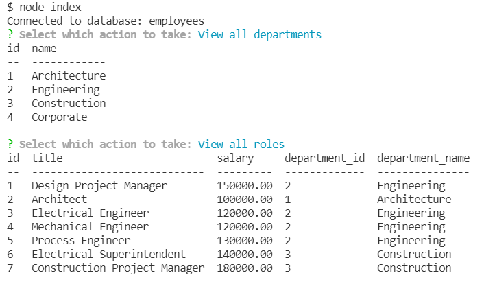

# employee-database

## Description
An application in which a user can utilize a MySQL database to store employee information such as department, role, and salaries.

## Installation
To install this application:
1. Clone repository
1. Download npm dependencies with 'npm install' command

## Usage
To use this application:
1. Invoke application start with 'node index.js' command
1. Follow the command line prompts

View this walk-through on how to use the employee database application:  
[Demonstration Video](https://watch.screencastify.com/v/Ik5Q8RjIUWRk3kEEpmrJ)

## Technologies
- JavaScript
- Node.js
- Node package manager (npm)
	- inquirer
	- mysql2
	- console.table
- MySQL

## Demo Images
*Preview of command line prompts*

## Questions
Reach out to me on GitHub or contact me by email address.  
- [GitHub Profile](https://github.com/kngurley25)  
- kngurley25@gmail.com